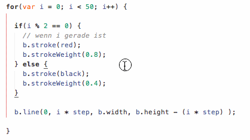
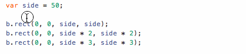
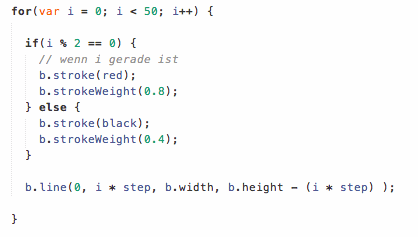
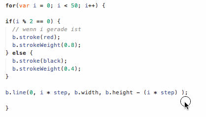
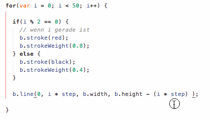

Sublime Text 3 Shortcuts

## Place several cursors
<kbd>Cmd</kbd> + <kbd>Click</kbd> allows to place several cursors into your code, so that you can type at several positions at once.

## Select identical text
Using <kbd>Cmd</kbd> + <kbd>D</kbd> (repeatedly) you can select the next occurences of an already selected text snippet. Once all required text positions are selected, you can start typing in all these positions at once.

## Move lines up/down
Using <kbd>Cmd</kbd> + <kbd>Ctrl</kbd> + <kbd>↑</kbd> or <kbd>Cmd</kbd> + <kbd>Ctrl</kbd> + <kbd>↓</kbd> you can move (a) selected line(s) up or down. If no lines are selected, this command moves the line of the currently placed cursor.

## Indent/un-indent lines
Using <kbd>Tab</kbd> you can indent multiple selected lines. Using <kbd>Shift</kbd> + <kbd>Tab</kbd> you can un-indent multiple selected lines.

## Comment/uncomment lines
<kbd>Cmd</kbd> + <kbd>Shift</kbd> + <kbd>7</kbd> allows to comment one or multiple lines. <kbd>Cmd</kbd> + <kbd>Shift</kbd> + <kbd>7</kbd> allows to uncomment lines that were already commented.

